# Phase 2: System Architecture Documentation

**Version:** 1.0  
**Date:** February 1, 2026  
**Purpose:** Detailed architecture diagrams and component interactions for Phase 2

---

## Table of Contents

1. [Overview](#overview)
2. [High-Level Architecture](#high-level-architecture)
3. [Component Diagrams](#component-diagrams)
4. [Data Flow Diagrams](#data-flow-diagrams)
5. [Sequence Diagrams](#sequence-diagrams)
6. [State Management](#state-management)
7. [Infrastructure Architecture](#infrastructure-architecture)

---

## Overview

Phase 2 introduces a multi-agent architecture powered by LangGraph and Gemini 2.0 Flash. The system transitions from a simple webhook handler to an intelligent orchestration layer with specialized agents.

### Architecture Principles

1. **Separation of Concerns:** Each agent has a single, well-defined responsibility
2. **Stateless Agents:** All state passed via LangGraph state object (functional)
3. **Fail-Safe:** Fallback to Phase 1 behavior if AI fails
4. **Cost-Conscious:** Token usage monitored and optimized
5. **Scalable:** Easy to add new agents (Phase 3+)

---

## High-Level Architecture

### System Overview

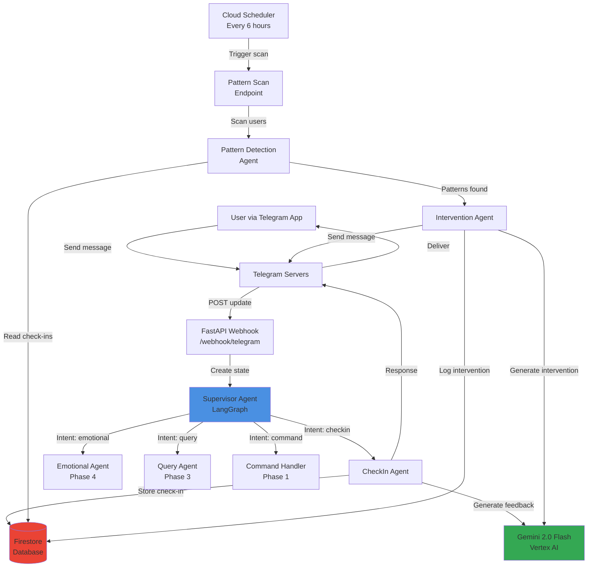
```mermaid
graph TB
    User[User via Telegram App]
    TelegramAPI[Telegram Servers]
    Webhook[FastAPI Webhook<br/>/webhook/telegram]
    Supervisor[Supervisor Agent<br/>LangGraph]
    
    CheckInAgent[CheckIn Agent]
    EmotionalAgent[Emotional Agent<br/>Phase 4]
    QueryAgent[Query Agent<br/>Phase 3]
    CommandHandler[Command Handler<br/>Phase 1]
    
    Gemini[Gemini 2.0 Flash<br/>Vertex AI]
    Firestore[(Firestore<br/>Database)]
    Scheduler[Cloud Scheduler<br/>Every 6 hours]
    PatternScan[Pattern Scan<br/>Endpoint]
    PatternAgent[Pattern Detection<br/>Agent]
    InterventionAgent[Intervention Agent]
    
    User -->|Send message| TelegramAPI
    TelegramAPI -->|POST update| Webhook
    Webhook -->|Create state| Supervisor
    
    Supervisor -->|Intent: checkin| CheckInAgent
    Supervisor -->|Intent: emotional| EmotionalAgent
    Supervisor -->|Intent: query| QueryAgent
    Supervisor -->|Intent: command| CommandHandler
    
    CheckInAgent -->|Generate feedback| Gemini
    InterventionAgent -->|Generate intervention| Gemini
    
    CheckInAgent -->|Store check-in| Firestore
    PatternAgent -->|Read check-ins| Firestore
    InterventionAgent -->|Log intervention| Firestore
    
    Scheduler -->|Trigger scan| PatternScan
    PatternScan -->|Scan users| PatternAgent
    PatternAgent -->|Patterns found| InterventionAgent
    InterventionAgent -->|Send message| TelegramAPI
    TelegramAPI -->|Deliver| User
    
    CheckInAgent -->|Response| TelegramAPI
    
    style Supervisor fill:#4A90E2
    style Gemini fill:#34A853
    style Firestore fill:#EA4335
```

### Architecture Layers

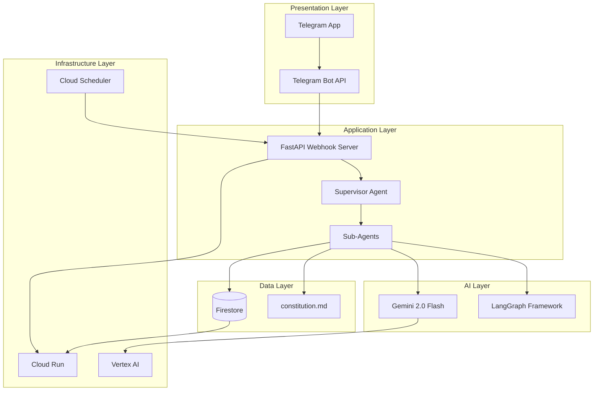
```mermaid
graph TD
    subgraph presentation [Presentation Layer]
        TelegramApp[Telegram App]
        TelegramBot[Telegram Bot API]
    end
    
    subgraph application [Application Layer]
        FastAPI[FastAPI Webhook Server]
        Supervisor[Supervisor Agent]
        Agents[Sub-Agents]
    end
    
    subgraph ai [AI Layer]
        Gemini[Gemini 2.0 Flash]
        LangGraph[LangGraph Framework]
    end
    
    subgraph data [Data Layer]
        Firestore[(Firestore)]
        Constitution[constitution.md]
    end
    
    subgraph infrastructure [Infrastructure Layer]
        CloudRun[Cloud Run]
        VertexAI[Vertex AI]
        CloudScheduler[Cloud Scheduler]
    end
    
    TelegramApp --> TelegramBot
    TelegramBot --> FastAPI
    FastAPI --> Supervisor
    Supervisor --> Agents
    Agents --> Gemini
    Agents --> LangGraph
    Agents --> Firestore
    Agents --> Constitution
    FastAPI --> CloudRun
    Gemini --> VertexAI
    Firestore --> CloudRun
    CloudScheduler --> FastAPI
```

---

## Component Diagrams

### Agent Hierarchy

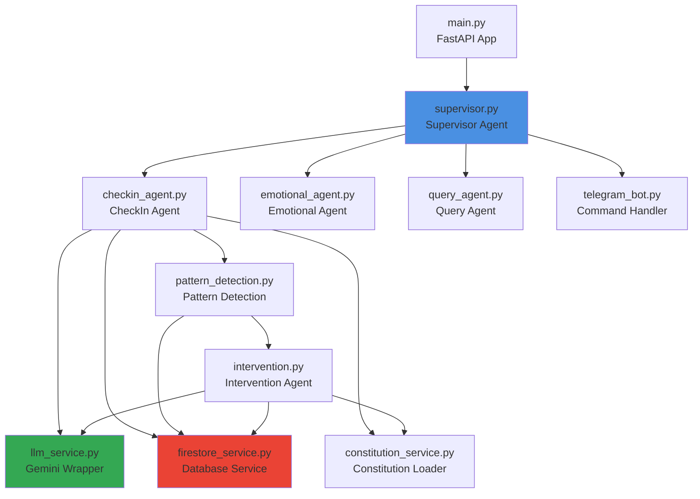
```mermaid
graph TD
    Main[main.py<br/>FastAPI App]
    Supervisor[supervisor.py<br/>Supervisor Agent]
    
    CheckIn[checkin_agent.py<br/>CheckIn Agent]
    Emotional[emotional_agent.py<br/>Emotional Agent]
    Query[query_agent.py<br/>Query Agent]
    Command[telegram_bot.py<br/>Command Handler]
    
    Pattern[pattern_detection.py<br/>Pattern Detection]
    Intervention[intervention.py<br/>Intervention Agent]
    
    LLM[llm_service.py<br/>Gemini Wrapper]
    FirestoreService[firestore_service.py<br/>Database Service]
    Constitution[constitution_service.py<br/>Constitution Loader]
    
    Main --> Supervisor
    Supervisor --> CheckIn
    Supervisor --> Emotional
    Supervisor --> Query
    Supervisor --> Command
    
    CheckIn --> Pattern
    Pattern --> Intervention
    
    CheckIn --> LLM
    Intervention --> LLM
    
    CheckIn --> FirestoreService
    Pattern --> FirestoreService
    Intervention --> FirestoreService
    
    CheckIn --> Constitution
    Intervention --> Constitution
    
    style Supervisor fill:#4A90E2
    style LLM fill:#34A853
    style FirestoreService fill:#EA4335
```

### Service Dependencies

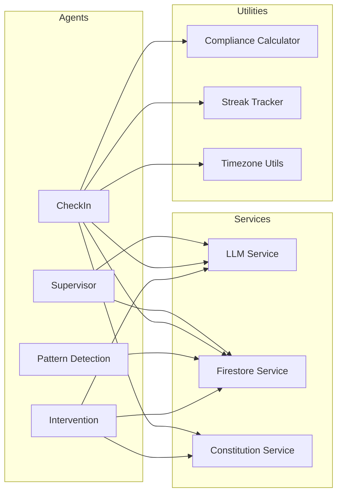
```mermaid
graph LR
    subgraph agents [Agents]
        SupervisorAgent[Supervisor]
        CheckInAgent[CheckIn]
        PatternAgent[Pattern Detection]
        InterventionAgent[Intervention]
    end
    
    subgraph services [Services]
        LLMService[LLM Service]
        FirestoreService[Firestore Service]
        ConstitutionService[Constitution Service]
    end
    
    subgraph utils [Utilities]
        Compliance[Compliance Calculator]
        Streak[Streak Tracker]
        Timezone[Timezone Utils]
    end
    
    SupervisorAgent --> LLMService
    SupervisorAgent --> FirestoreService
    
    CheckInAgent --> LLMService
    CheckInAgent --> FirestoreService
    CheckInAgent --> ConstitutionService
    CheckInAgent --> Compliance
    CheckInAgent --> Streak
    CheckInAgent --> Timezone
    
    PatternAgent --> FirestoreService
    
    InterventionAgent --> LLMService
    InterventionAgent --> FirestoreService
    InterventionAgent --> ConstitutionService
```

---

## Data Flow Diagrams

### Check-In Flow with AI Feedback

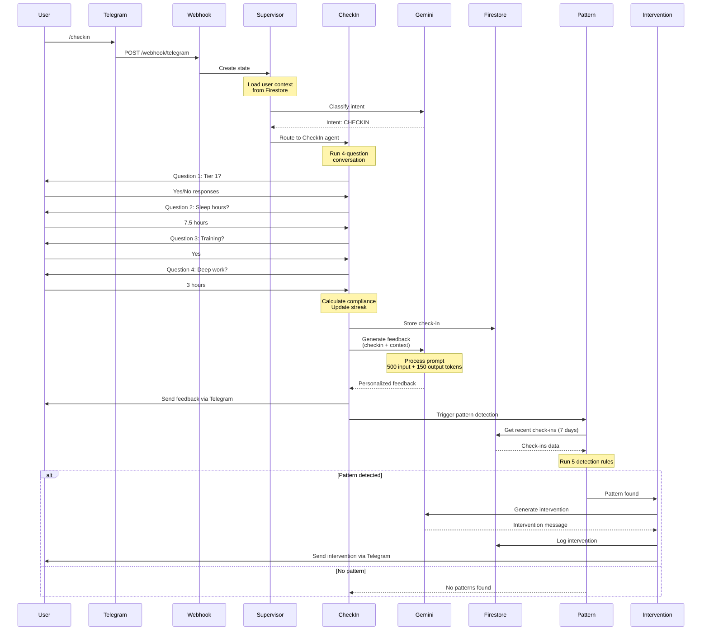
```mermaid
sequenceDiagram
    participant User
    participant Telegram
    participant Webhook
    participant Supervisor
    participant CheckIn
    participant Gemini
    participant Firestore
    participant Pattern
    participant Intervention
    
    User->>Telegram: /checkin
    Telegram->>Webhook: POST /webhook/telegram
    Webhook->>Supervisor: Create state
    
    Note over Supervisor: Load user context<br/>from Firestore
    Supervisor->>Gemini: Classify intent
    Gemini-->>Supervisor: Intent: CHECKIN
    
    Supervisor->>CheckIn: Route to CheckIn agent
    
    Note over CheckIn: Run 4-question<br/>conversation
    CheckIn->>User: Question 1: Tier 1?
    User->>CheckIn: Yes/No responses
    CheckIn->>User: Question 2: Sleep hours?
    User->>CheckIn: 7.5 hours
    CheckIn->>User: Question 3: Training?
    User->>CheckIn: Yes
    CheckIn->>User: Question 4: Deep work?
    User->>CheckIn: 3 hours
    
    Note over CheckIn: Calculate compliance<br/>Update streak
    
    CheckIn->>Firestore: Store check-in
    
    CheckIn->>Gemini: Generate feedback<br/>(checkin + context)
    Note over Gemini: Process prompt<br/>500 input + 150 output tokens
    Gemini-->>CheckIn: Personalized feedback
    
    CheckIn->>User: Send feedback via Telegram
    
    CheckIn->>Pattern: Trigger pattern detection
    Pattern->>Firestore: Get recent check-ins (7 days)
    Firestore-->>Pattern: Check-ins data
    
    Note over Pattern: Run 5 detection rules
    
    alt Pattern detected
        Pattern->>Intervention: Pattern found
        Intervention->>Gemini: Generate intervention
        Gemini-->>Intervention: Intervention message
        Intervention->>Firestore: Log intervention
        Intervention->>User: Send intervention via Telegram
    else No pattern
        Pattern-->>CheckIn: No patterns found
    end
```

### Scheduled Pattern Scan Flow

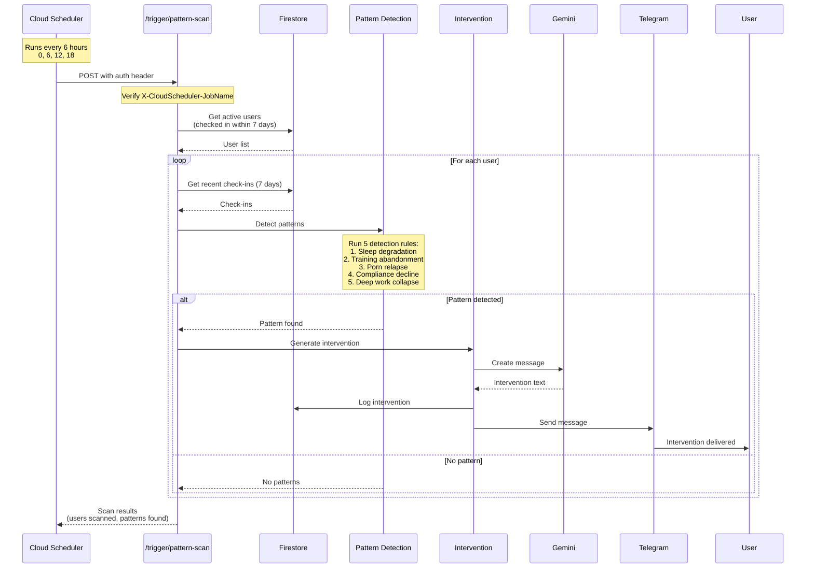
```mermaid
sequenceDiagram
    participant Scheduler as Cloud Scheduler
    participant Endpoint as /trigger/pattern-scan
    participant Firestore
    participant Pattern as Pattern Detection
    participant Intervention
    participant Gemini
    participant Telegram
    participant User
    
    Note over Scheduler: Runs every 6 hours<br/>0, 6, 12, 18
    
    Scheduler->>Endpoint: POST with auth header
    
    Note over Endpoint: Verify X-CloudScheduler-JobName
    
    Endpoint->>Firestore: Get active users<br/>(checked in within 7 days)
    Firestore-->>Endpoint: User list
    
    loop For each user
        Endpoint->>Firestore: Get recent check-ins (7 days)
        Firestore-->>Endpoint: Check-ins
        
        Endpoint->>Pattern: Detect patterns
        
        Note over Pattern: Run 5 detection rules:<br/>1. Sleep degradation<br/>2. Training abandonment<br/>3. Porn relapse<br/>4. Compliance decline<br/>5. Deep work collapse
        
        alt Pattern detected
            Pattern-->>Endpoint: Pattern found
            
            Endpoint->>Intervention: Generate intervention
            Intervention->>Gemini: Create message
            Gemini-->>Intervention: Intervention text
            
            Intervention->>Firestore: Log intervention
            Intervention->>Telegram: Send message
            Telegram->>User: Intervention delivered
        else No pattern
            Pattern-->>Endpoint: No patterns
        end
    end
    
    Endpoint-->>Scheduler: Scan results<br/>(users scanned, patterns found)
```

### Intent Classification Flow

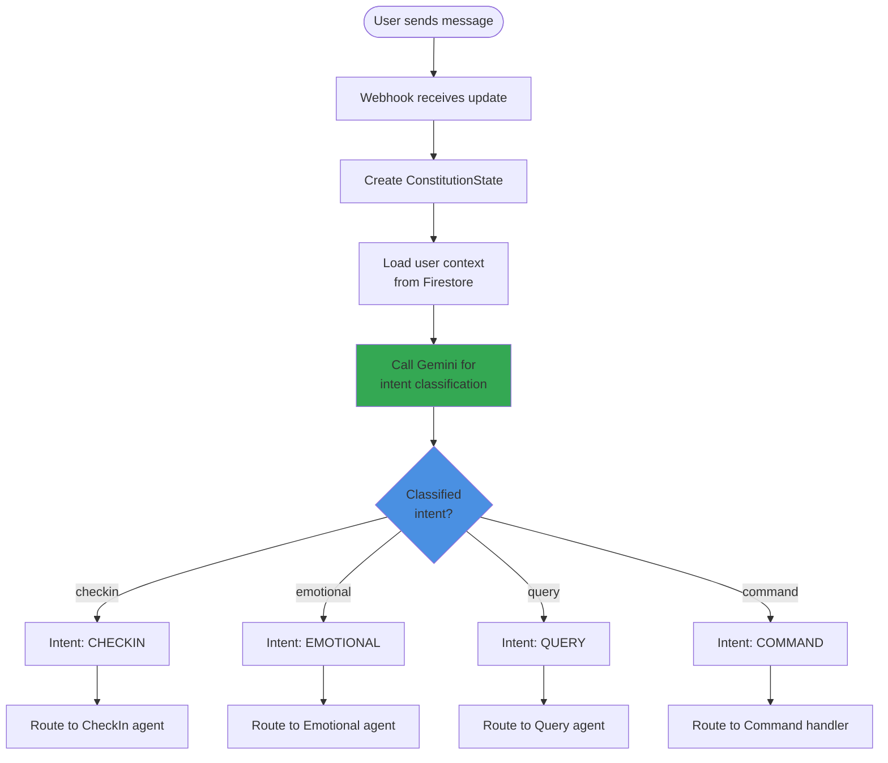
```mermaid
flowchart TD
    Start([User sends message])
    
    Webhook[Webhook receives update]
    CreateState[Create ConstitutionState]
    LoadContext[Load user context<br/>from Firestore]
    
    CallGemini[Call Gemini for<br/>intent classification]
    
    CheckIntent{Classified<br/>intent?}
    
    IntentCheckin[Intent: CHECKIN]
    IntentEmotional[Intent: EMOTIONAL]
    IntentQuery[Intent: QUERY]
    IntentCommand[Intent: COMMAND]
    
    RouteCheckin[Route to CheckIn agent]
    RouteEmotional[Route to Emotional agent]
    RouteQuery[Route to Query agent]
    RouteCommand[Route to Command handler]
    
    Start --> Webhook
    Webhook --> CreateState
    CreateState --> LoadContext
    LoadContext --> CallGemini
    
    CallGemini --> CheckIntent
    
    CheckIntent -->|checkin| IntentCheckin
    CheckIntent -->|emotional| IntentEmotional
    CheckIntent -->|query| IntentQuery
    CheckIntent -->|command| IntentCommand
    
    IntentCheckin --> RouteCheckin
    IntentEmotional --> RouteEmotional
    IntentQuery --> RouteQuery
    IntentCommand --> RouteCommand
    
    style CallGemini fill:#34A853
    style CheckIntent fill:#4A90E2
```

---

## Sequence Diagrams

### Pattern Detection Trigger Points

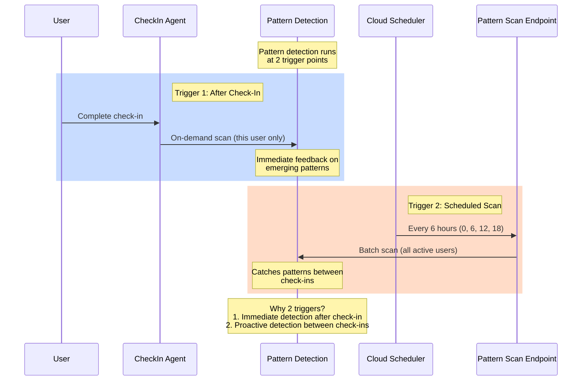
```mermaid
sequenceDiagram
    participant User
    participant CheckIn as CheckIn Agent
    participant Pattern as Pattern Detection
    participant Scheduler as Cloud Scheduler
    participant Scan as Pattern Scan Endpoint
    
    Note over Pattern: Pattern detection runs<br/>at 2 trigger points
    
    rect rgb(200, 220, 255)
        Note right of CheckIn: Trigger 1: After Check-In
        User->>CheckIn: Complete check-in
        CheckIn->>Pattern: On-demand scan (this user only)
        Note over Pattern: Immediate feedback on<br/>emerging patterns
    end
    
    rect rgb(255, 220, 200)
        Note right of Scheduler: Trigger 2: Scheduled Scan
        Scheduler->>Scan: Every 6 hours (0, 6, 12, 18)
        Scan->>Pattern: Batch scan (all active users)
        Note over Pattern: Catches patterns between<br/>check-ins
    end
    
    Note over Pattern: Why 2 triggers?<br/>1. Immediate detection after check-in<br/>2. Proactive detection between check-ins
```

### Error Handling & Fallbacks

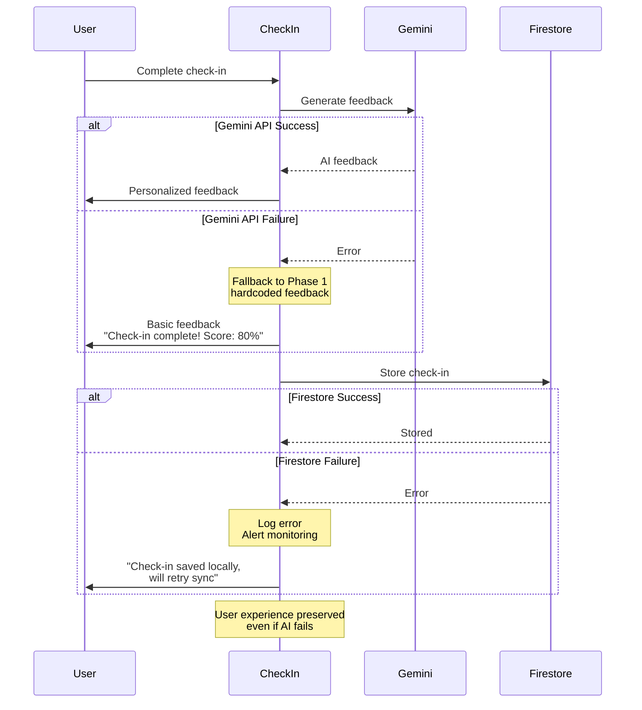
```mermaid
sequenceDiagram
    participant User
    participant CheckIn
    participant Gemini
    participant Firestore
    
    User->>CheckIn: Complete check-in
    
    CheckIn->>Gemini: Generate feedback
    
    alt Gemini API Success
        Gemini-->>CheckIn: AI feedback
        CheckIn->>User: Personalized feedback
    else Gemini API Failure
        Gemini-->>CheckIn: Error
        Note over CheckIn: Fallback to Phase 1<br/>hardcoded feedback
        CheckIn->>User: Basic feedback<br/>"Check-in complete! Score: 80%"
    end
    
    CheckIn->>Firestore: Store check-in
    
    alt Firestore Success
        Firestore-->>CheckIn: Stored
    else Firestore Failure
        Firestore-->>CheckIn: Error
        Note over CheckIn: Log error<br/>Alert monitoring
        CheckIn->>User: "Check-in saved locally,<br/>will retry sync"
    end
    
    Note over CheckIn: User experience preserved<br/>even if AI fails
```

---

## State Management

### LangGraph State Schema

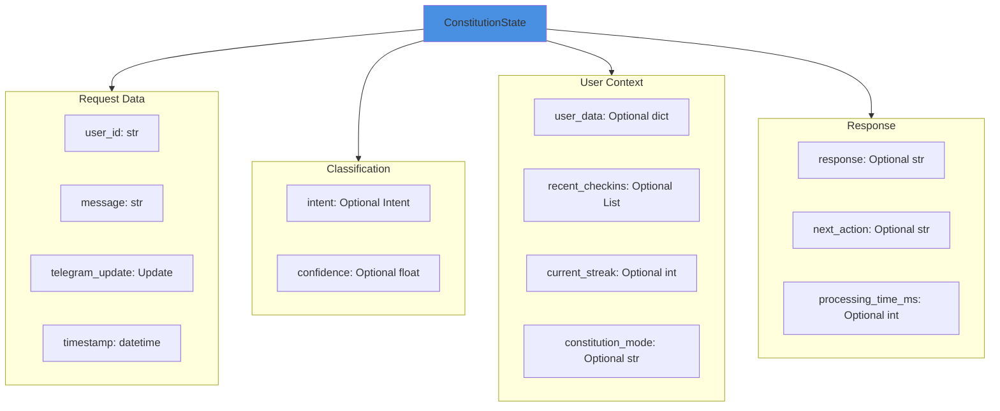
```mermaid
graph TD
    State[ConstitutionState]
    
    subgraph request [Request Data]
        UserId[user_id: str]
        Message[message: str]
        Update[telegram_update: Update]
        Timestamp[timestamp: datetime]
    end
    
    subgraph classification [Classification]
        Intent[intent: Optional Intent]
        Confidence[confidence: Optional float]
    end
    
    subgraph context [User Context]
        UserData[user_data: Optional dict]
        RecentCheckins[recent_checkins: Optional List]
        CurrentStreak[current_streak: Optional int]
        Mode[constitution_mode: Optional str]
    end
    
    subgraph response [Response]
        ResponseText[response: Optional str]
        NextAction[next_action: Optional str]
        ProcessingTime[processing_time_ms: Optional int]
    end
    
    State --> request
    State --> classification
    State --> context
    State --> response
    
    style State fill:#4A90E2
```

### State Flow Through Agents

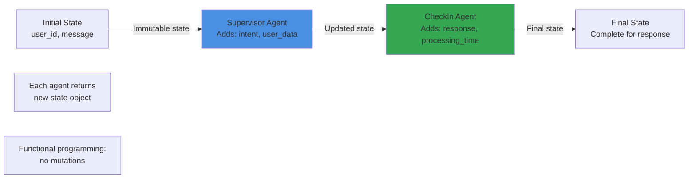
```mermaid
flowchart LR
    Initial[Initial State<br/>user_id, message]
    
    Supervisor[Supervisor Agent<br/>Adds: intent, user_data]
    
    CheckIn[CheckIn Agent<br/>Adds: response, processing_time]
    
    Final[Final State<br/>Complete for response]
    
    Initial -->|Immutable state| Supervisor
    Supervisor -->|Updated state| CheckIn
    CheckIn -->|Final state| Final
    
    Note1[Each agent returns<br/>new state object]
    Note2[Functional programming:<br/>no mutations]
    
    style Supervisor fill:#4A90E2
    style CheckIn fill:#34A853
```

---

## Infrastructure Architecture

### GCP Service Integration

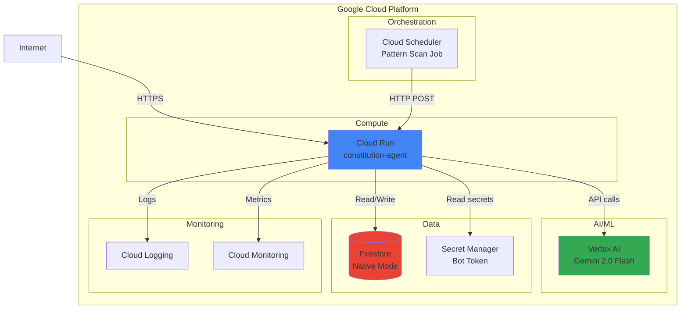
```mermaid
graph TB
    subgraph gcp [Google Cloud Platform]
        subgraph compute [Compute]
            CloudRun[Cloud Run<br/>constitution-agent]
        end
        
        subgraph ai [AI/ML]
            VertexAI[Vertex AI<br/>Gemini 2.0 Flash]
        end
        
        subgraph data [Data]
            Firestore[(Firestore<br/>Native Mode)]
            SecretManager[Secret Manager<br/>Bot Token]
        end
        
        subgraph orchestration [Orchestration]
            CloudScheduler[Cloud Scheduler<br/>Pattern Scan Job]
        end
        
        subgraph monitoring [Monitoring]
            CloudLogging[Cloud Logging]
            CloudMonitoring[Cloud Monitoring]
        end
    end
    
    Internet[Internet] -->|HTTPS| CloudRun
    CloudRun -->|API calls| VertexAI
    CloudRun -->|Read/Write| Firestore
    CloudRun -->|Read secrets| SecretManager
    CloudScheduler -->|HTTP POST| CloudRun
    CloudRun -->|Logs| CloudLogging
    CloudRun -->|Metrics| CloudMonitoring
    
    style CloudRun fill:#4285F4
    style VertexAI fill:#34A853
    style Firestore fill:#EA4335
```

### Network Architecture

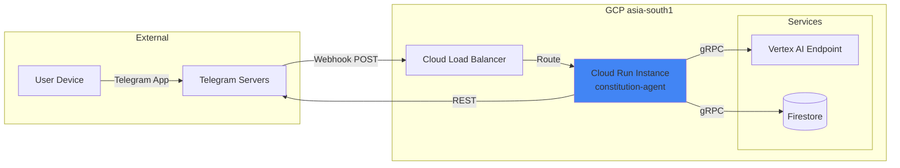
```mermaid
graph LR
    subgraph external [External]
        TelegramServers[Telegram Servers]
        User[User Device]
    end
    
    subgraph gcp [GCP asia-south1]
        LoadBalancer[Cloud Load Balancer]
        CloudRun[Cloud Run Instance<br/>constitution-agent]
        
        subgraph services [Services]
            VertexAI[Vertex AI Endpoint]
            Firestore[(Firestore)]
        end
    end
    
    TelegramServers -->|Webhook POST| LoadBalancer
    User -->|Telegram App| TelegramServers
    
    LoadBalancer -->|Route| CloudRun
    CloudRun -->|gRPC| VertexAI
    CloudRun -->|gRPC| Firestore
    
    CloudRun -->|REST| TelegramServers
    
    style CloudRun fill:#4285F4
```

### Deployment Architecture

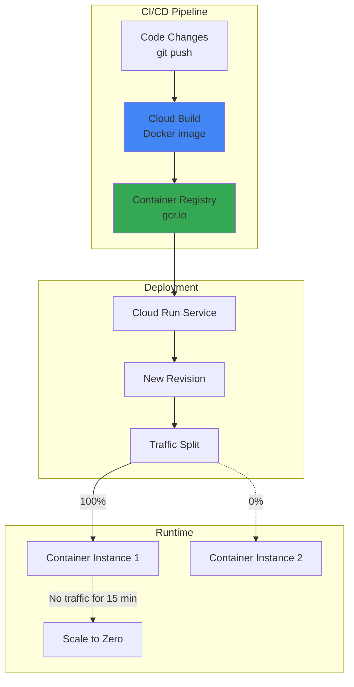
```mermaid
graph TD
    subgraph ci [CI/CD Pipeline]
        Code[Code Changes<br/>git push]
        Build[Cloud Build<br/>Docker image]
        Registry[Container Registry<br/>gcr.io]
    end
    
    subgraph deployment [Deployment]
        CloudRun[Cloud Run Service]
        Revision[New Revision]
        Traffic[Traffic Split]
    end
    
    subgraph runtime [Runtime]
        Container1[Container Instance 1]
        Container2[Container Instance 2]
        ScaleToZero[Scale to Zero]
    end
    
    Code --> Build
    Build --> Registry
    Registry --> CloudRun
    CloudRun --> Revision
    Revision --> Traffic
    
    Traffic -->|100%| Container1
    Traffic -.->|0%| Container2
    
    Container1 -.->|No traffic for 15 min| ScaleToZero
    
    style Build fill:#4285F4
    style Registry fill:#34A853
```

---

## Cost Architecture

### Token Flow & Monitoring

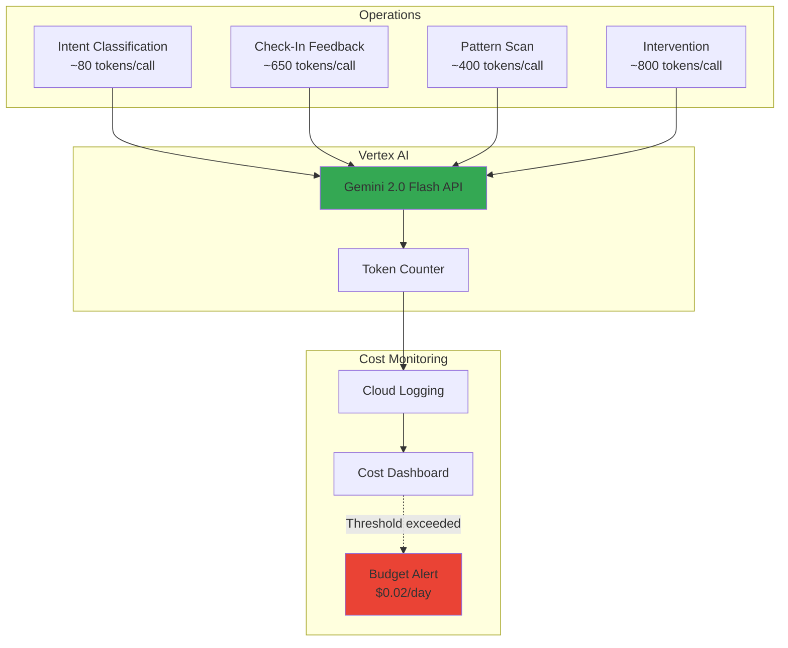
```mermaid
graph TD
    subgraph operations [Operations]
        IntentClass[Intent Classification<br/>~80 tokens/call]
        Feedback[Check-In Feedback<br/>~650 tokens/call]
        Scan[Pattern Scan<br/>~400 tokens/call]
        Intervention[Intervention<br/>~800 tokens/call]
    end
    
    subgraph vertex [Vertex AI]
        Gemini[Gemini 2.0 Flash API]
        TokenCounter[Token Counter]
    end
    
    subgraph monitoring [Cost Monitoring]
        Logger[Cloud Logging]
        Dashboard[Cost Dashboard]
        Alert[Budget Alert<br/>$0.02/day]
    end
    
    IntentClass --> Gemini
    Feedback --> Gemini
    Scan --> Gemini
    Intervention --> Gemini
    
    Gemini --> TokenCounter
    TokenCounter --> Logger
    Logger --> Dashboard
    Dashboard -.->|Threshold exceeded| Alert
    
    style Gemini fill:#34A853
    style Alert fill:#EA4335
```

### Cost Optimization Strategy

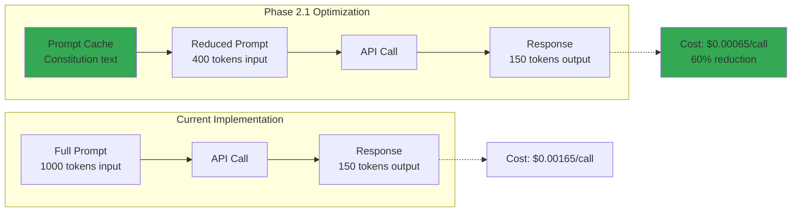
```mermaid
graph LR
    subgraph current [Current Implementation]
        Prompt1[Full Prompt<br/>1000 tokens input]
        API1[API Call]
        Response1[Response<br/>150 tokens output]
    end
    
    subgraph optimized [Phase 2.1 Optimization]
        Cache[Prompt Cache<br/>Constitution text]
        Prompt2[Reduced Prompt<br/>400 tokens input]
        API2[API Call]
        Response2[Response<br/>150 tokens output]
    end
    
    Prompt1 --> API1
    API1 --> Response1
    
    Cache --> Prompt2
    Prompt2 --> API2
    API2 --> Response2
    
    Note1[Cost: $0.00165/call]
    Note2[Cost: $0.00065/call<br/>60% reduction]
    
    Response1 -.-> Note1
    Response2 -.-> Note2
    
    style Cache fill:#34A853
    style Note2 fill:#34A853
```

---

## Scalability Architecture

### Agent Scaling (Phase 3+)

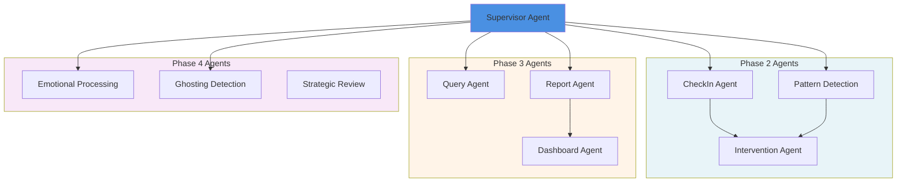
```mermaid
graph TD
    Supervisor[Supervisor Agent]
    
    subgraph phase2 [Phase 2 Agents]
        CheckIn[CheckIn Agent]
        Pattern[Pattern Detection]
        Intervention[Intervention Agent]
    end
    
    subgraph phase3 [Phase 3 Agents]
        Query[Query Agent]
        Report[Report Agent]
        Dashboard[Dashboard Agent]
    end
    
    subgraph phase4 [Phase 4 Agents]
        Emotional[Emotional Processing]
        Ghosting[Ghosting Detection]
        Strategic[Strategic Review]
    end
    
    Supervisor --> CheckIn
    Supervisor --> Pattern
    Supervisor --> Query
    Supervisor --> Report
    Supervisor --> Emotional
    Supervisor --> Ghosting
    
    CheckIn --> Intervention
    Pattern --> Intervention
    Report --> Dashboard
    
    style Supervisor fill:#4A90E2
    style phase2 fill:#E8F4F8
    style phase3 fill:#FFF4E8
    style phase4 fill:#F8E8F8
```

### Multi-User Scaling

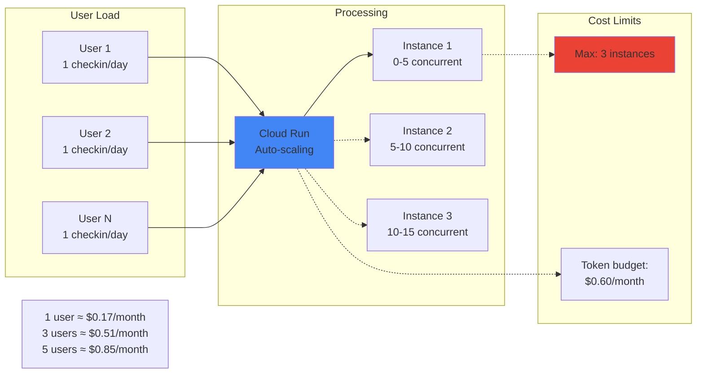
```mermaid
graph LR
    subgraph load [User Load]
        User1[User 1<br/>1 checkin/day]
        User2[User 2<br/>1 checkin/day]
        UserN[User N<br/>1 checkin/day]
    end
    
    subgraph processing [Processing]
        CloudRun[Cloud Run<br/>Auto-scaling]
        
        Instance1[Instance 1<br/>0-5 concurrent]
        Instance2[Instance 2<br/>5-10 concurrent]
        Instance3[Instance 3<br/>10-15 concurrent]
    end
    
    subgraph limits [Cost Limits]
        MaxInstances[Max: 3 instances]
        TokenBudget[Token budget:<br/>$0.60/month]
    end
    
    User1 --> CloudRun
    User2 --> CloudRun
    UserN --> CloudRun
    
    CloudRun --> Instance1
    CloudRun -.-> Instance2
    CloudRun -.-> Instance3
    
    Instance1 -.-> MaxInstances
    CloudRun -.-> TokenBudget
    
    Note1[1 user ≈ $0.17/month<br/>3 users ≈ $0.51/month<br/>5 users ≈ $0.85/month]
    
    style CloudRun fill:#4285F4
    style MaxInstances fill:#EA4335
```

---

## Security Architecture

### Authentication Flow

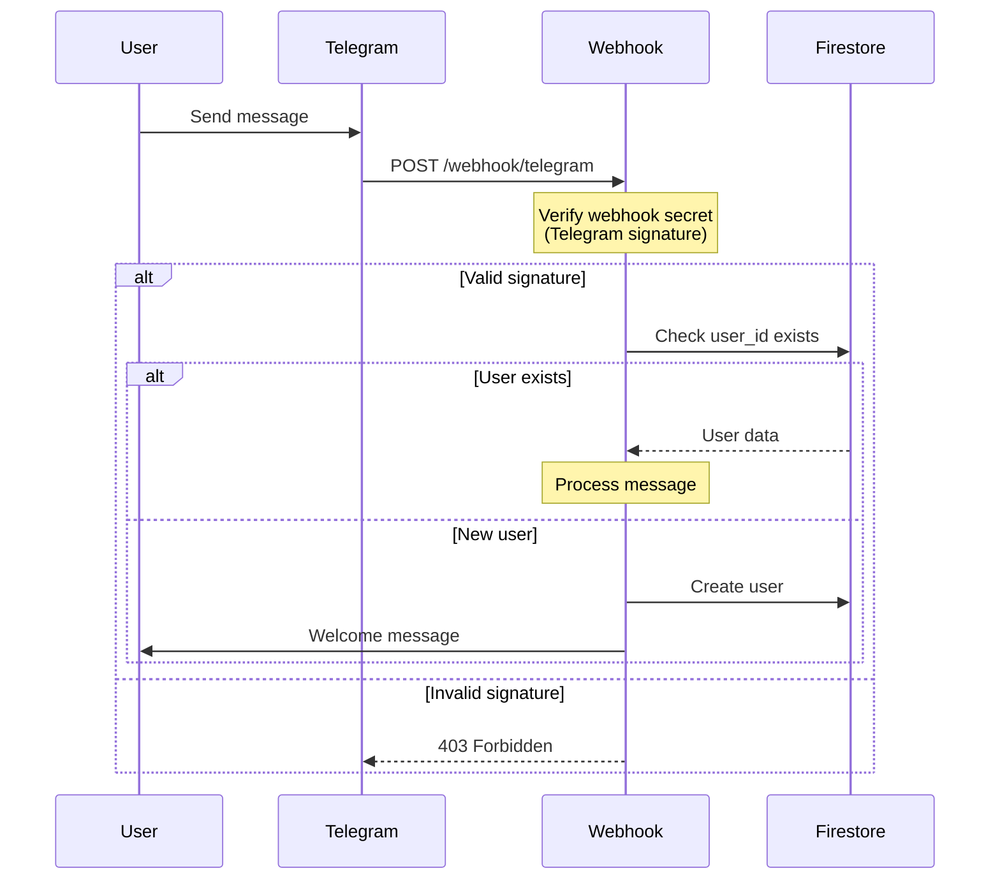
```mermaid
sequenceDiagram
    participant User
    participant Telegram
    participant Webhook
    participant Firestore
    
    User->>Telegram: Send message
    
    Telegram->>Webhook: POST /webhook/telegram
    Note over Webhook: Verify webhook secret<br/>(Telegram signature)
    
    alt Valid signature
        Webhook->>Firestore: Check user_id exists
        
        alt User exists
            Firestore-->>Webhook: User data
            Note over Webhook: Process message
        else New user
            Webhook->>Firestore: Create user
            Webhook->>User: Welcome message
        end
    else Invalid signature
        Webhook-->>Telegram: 403 Forbidden
    end
```

### Secrets Management

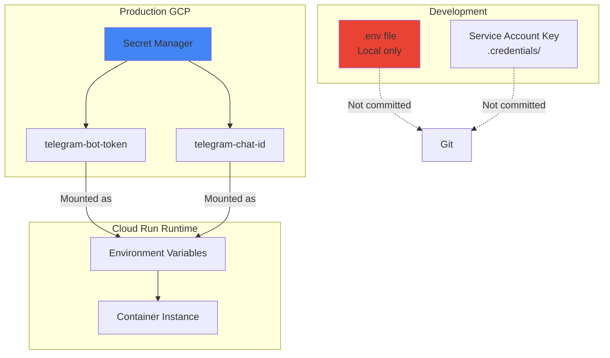
```mermaid
graph TD
    subgraph development [Development]
        EnvFile[.env file<br/>Local only]
        ServiceAccount[Service Account Key<br/>.credentials/]
    end
    
    subgraph production [Production GCP]
        SecretManager[Secret Manager]
        BotToken[telegram-bot-token]
        ChatID[telegram-chat-id]
    end
    
    subgraph runtime [Cloud Run Runtime]
        CloudRun[Container Instance]
        EnvVars[Environment Variables]
    end
    
    EnvFile -.->|Not committed| Git
    ServiceAccount -.->|Not committed| Git
    
    SecretManager --> BotToken
    SecretManager --> ChatID
    
    BotToken -->|Mounted as| EnvVars
    ChatID -->|Mounted as| EnvVars
    
    EnvVars --> CloudRun
    
    style SecretManager fill:#4285F4
    style EnvFile fill:#EA4335
```

---

## Monitoring Architecture

### Observability Stack

```mermaid
graph TD
    subgraph app [Application]
        CloudRun[Cloud Run Service]
        Logs[Application Logs]
        Metrics[Custom Metrics]
    end
    
    subgraph gcp_monitoring [GCP Monitoring]
        CloudLogging[Cloud Logging]
        CloudMonitoring[Cloud Monitoring]
        ErrorReporting[Error Reporting]
    end
    
    subgraph alerts [Alerting]
        BudgetAlert[Budget Alert<br/>$0.02/day]
        ErrorAlert[Error Alert<br/>>5% errors]
        LatencyAlert[Latency Alert<br/>>5s p99]
    end
    
    subgraph dashboards [Dashboards]
        CostDashboard[Cost Dashboard]
        PerformanceDashboard[Performance Dashboard]
        UsageDashboard[Usage Dashboard]
    end
    
    CloudRun --> Logs
    CloudRun --> Metrics
    
    Logs --> CloudLogging
    Metrics --> CloudMonitoring
    CloudLogging --> ErrorReporting
    
    CloudMonitoring -.->|Threshold exceeded| BudgetAlert
    ErrorReporting -.->|Error rate high| ErrorAlert
    CloudMonitoring -.->|Latency high| LatencyAlert
    
    CloudLogging --> CostDashboard
    CloudMonitoring --> PerformanceDashboard
    CloudLogging --> UsageDashboard
    
    style CloudLogging fill:#4285F4
    style BudgetAlert fill:#EA4335
```

### Metrics Collection

```mermaid
graph LR
    subgraph metrics [Key Metrics]
        TokenUsage[Token Usage<br/>per operation]
        ResponseTime[Response Time<br/>per agent]
        ErrorRate[Error Rate<br/>per endpoint]
        PatternCount[Patterns Detected<br/>per day]
    end
    
    subgraph collection [Collection]
        Logger[Python Logger]
        CustomMetrics[Custom Metrics API]
    end
    
    subgraph storage [Storage & Analysis]
        CloudLogging[Cloud Logging]
        CloudMonitoring[Cloud Monitoring]
        BigQuery[BigQuery<br/>Long-term analysis]
    end
    
    TokenUsage --> Logger
    ResponseTime --> CustomMetrics
    ErrorRate --> Logger
    PatternCount --> Logger
    
    Logger --> CloudLogging
    CustomMetrics --> CloudMonitoring
    
    CloudLogging -.->|Export| BigQuery
    CloudMonitoring -.->|Export| BigQuery
    
    style BigQuery fill:#4285F4
```

---

## Summary

This architecture documentation provides:

1. **Visual representations** of all Phase 2 components
2. **Data flow diagrams** showing message processing
3. **Sequence diagrams** for key operations
4. **Infrastructure layout** on GCP
5. **Scalability patterns** for Phase 3+
6. **Security and monitoring** strategies

**Key Takeaways:**

- **Multi-agent architecture** enables specialized processing
- **LangGraph state management** keeps agents stateless and testable
- **Gemini 2.0 Flash** provides AI intelligence at low cost
- **Cloud Run + Firestore** enable serverless, scalable deployment
- **Cost monitoring** built into every layer
- **Fallback strategies** ensure reliability

**Next Steps:**

1. Review architecture with team
2. Validate component interactions
3. Begin Day 1 implementation (LangGraph foundation)
4. Iterate on architecture as needed

---

**Document Version:** 1.0  
**Last Updated:** February 1, 2026  
**Status:** Approved for Implementation
